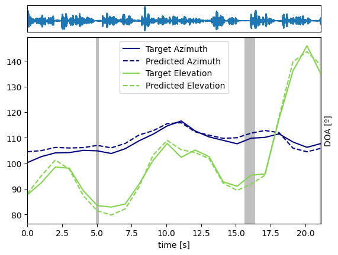

# Neural-SRP

This repository contains the code for the Neural-SRP paper, [published in](https://ieeexplore.ieee.org/document/10345765) the Open Journal of Signal Processing (OJSP).
Neural-SRP is a neural network-based multi-source tracking algorithm which combines
architectural features from SRP-PHAT,
an established model-based algorithm for sound source localization. 

This code contains the code used for training the Neural-SRP method under different
scenarios, 
and also the code used for evaluating the performance of the trained models on the
LOCATA and TAU-NIGENS datasets.

## Configuration

Parameters are controled in the `params.json` file. Note that some parameters should be changed depending on the script being run,
as detailed below. The most important parameters are:
* `model`: the model to be trained. It can be `neural_srp`, `doanet`, `cross3d` or `srp`. `doanet` only works for the TAU-NIGENS (`train_multisource.py`) dataset.
* `win_size`: the window size in samples. Set to 640 when using the TAU-NIGENS dataset, and 4096 when using the LOCATA dataset.
* `hop_size`: the hop size in percentage. Set to 0.5 when using the TAU-NIGENS dataset, and 0.75 when using the LOCATA dataset.
* `model_checkpoint_path`: the path to the pretrained model. Must be compatible with the `model` parameter.

## Main scripts
After setting the correct parameters in `params.json`, you can run the following scripts using `python script_name.py`.
They are:

* `visualize_locata.py` Visualize single-source tracking trajectories on the LOCATA dataset. Generates results of Tables 3 and 4 in the paper.
* `visualize_tau.py` Visualize multi-source tracking trajectories on the TAU-NIGENS dataset. Generates results of Table 5 in the paper.
* `train_singlesource.py` trains the single-source models using simulated data.
* `train_multisource.py` trains the multi-source models using the TAU-NIGENS dataset.
* `analyze_complexity.py` analyzes the complexity of the different models. Generates results of Table 6 in the paper.

## Pretrained models

You can find the pretrained models in the `checkpoints` folder. You must also change the variables in `params.json` to point to the correct model
and to use thee correct parameters as defined in the Configuration section above.

## Datasets

* LOCATA [LOCATA challenge](https://www.locata.lms.tf.fau.de/). 
* TAU-NIGENS [TAU-NIGENS dataset](https://dcase.community/challenge2021/task-sound-event-localization-and-detection#:~:text=The%20TAU%2DNIGENS%20Spatial%20Sound,seen%20from%20the%20recording%20position). After downloading and extracting the files metadata_dev.zip, mic_dev.z01, mic_dev.zip and mic_eval.zip, run the preprocessing script `python -m datasets.preprocess_tau_nigens_dataset` to generate the dataset in the correct format. Set the variable `path_tau_nigens_preprocessed` to the path of the output preprocessed dataset in `params.json`.
